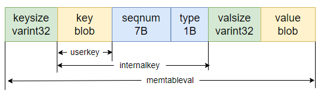

# MemTable

成员变量

- comparator_，InternalKey 的 comparator
- refs_，当前 memtable 被引用数，可能被多个线程共享
- arena_，内存分配器
- table_，是一个 skiplist 对象

# 并发

SkipList 中指针通过 `std::atomic<Node*>[]` 实现

LevelDB 中对 SkipList 的实现增加了多线程并发访问方面的优化的代码，提供以下保证：

1. Write：在修改跳表时，需要在用户代码侧加锁。
2. Read：在访问跳表（查找、遍历）时，只需保证跳表不被其他线程销毁即可，不必额外加锁。
也就是说，用户侧只需要处理写写冲突，LevelDB 跳表保证没有读写冲突。

这是因为在实现时，LevelDB 做了以下假设（Invariants）：

1. 除非跳表被销毁，跳表节点只会增加而不会被删除，因为跳表对外根本不提供删除接口。
2. 被插入到跳表中的节点，除了 next 指针其他域都是不可变的，并且只有插入操作会改变跳表。

（这里写错了 keysize 应该换成 internal_key_size）

**插入**
其中 memtable 的跳表中保存的是 keyvalue 编码的结果，并没有将 keyvalue 分开存储。

它提供了一个迭代器实现了对 skiplist 的各种操作，实际上调用了 skiplist 本身的迭代器

**查找**
memtable 查找时通过一个 LookupKey 进行查找 (user_key | batch_seqnum | type)

# memtable to immutable memtable

## MakeRoomForWrite

1. 如果 L0 SST 大小大于 kL0_SlowdownWritesTrigger=8 慢写阈值，则延迟 1s 后将 mem 变长 imm
2. 如果 force 为 false，且 memtable 大小没有超过 4KB，则退出不用转换
3. 如果当前有未完成的 Minor Compaction（mem->imm），则等待完成后退出后执行
4. 如果 L0 SST 大小超过 kL0_StopWritesTrigger，则睡眠等待被唤醒，等待数量比较少时继续
5. 打开新的 WAL 作 immutable mem 的备份，释放旧的 WAL，然后先写 WAL 后写 immutable mem

LevelDB每次写入key-value都是写入到内存中的Memtable中的，但是Memtable的空间不是无限的，Memtable写满（默认4MB）后，就需要调用MakeRoomForWrite把Memtable转存为Immutable Memtable，并创建新的Memtable来存储写入数据。必要时还会调度后台线程把Immutable Memtable落盘，以及合并SST文件。

1. 如果允许 delay，并且 l0 层文件数量超过慢写阈值（默认 8 个文件），就等待 1ms，然后把 allow_delay 设置为 false，所以慢写延迟操作最多执行一次，避免上面的 Writer 主流程被阻塞太久
2. 