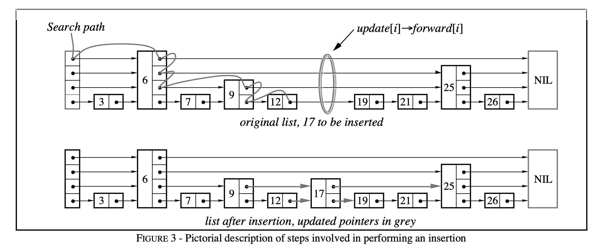

# 构造

初始化时，创建一个空的头节点，头节点含有 MaxLevel 个指针，每个指针指向每一层的下一个节点

# 插入




```cpp
template <typename Key, class Comparator>
void SkipList<Key, Comparator>::Insert(const Key& key) {
  // 待做(opt): 由于插入要求外部加锁，因此可以使用 NoBarrier_Next 的 FindGreaterOrEqual 以提高性能
  Node* prev[kMaxHeight]; // 长度设定简单粗暴，直接取最大值（kMaxHeight = 12）肯定没错。
  Node* x = FindGreaterOrEqual(key, prev);

  // LevelDB 跳表要求不能插入重复数据
  assert(x == nullptr || !Equal(key, x->key));

  int height = RandomHeight(); // 随机获取一个 level 值
  if (height > GetMaxHeight()) { // GetMaxHeight() 为获取跳表当前层数
    for (int i = GetMaxHeight(); i < height; i++) {
      prev[i] = head_;
    }
    // 此处不用为并发读加锁。因为并发读在（在另外线程中通过 FindGreaterOrEqual 中的 GetMaxHeight）
    // 读取到更新后跳表层数，但该节点尚未插入时也无妨。因为这意味着它会读到 nullptr，而在 LevelDB
    // 的 Comparator 设定中，nullptr 比所有 key 都大。因此，FindGreaterOrEqual 会继续往下找，
    // 符合预期。
    max_height_.store(height, std::memory_order_relaxed);
  }

  x = NewNode(key, height);
  for (int i = 0; i < height; i++) {
    // 此句 NoBarrier_SetNext() 版本就够用了，因为后续 prev[i]->SetNext(i, x) 语句会进行强制同步。
    // 并且为了保证并发读的正确性，一定要先设置本节点指针，再设置原条表中节点（prev）指针
    x->NoBarrier_SetNext(i, prev[i]->NoBarrier_Next(i));
    prev[i]->SetNext(i, x);
  }
}
```

pre 记录了查找过程中每一层的前驱节点，插入的时候会根据一个概率增加一层

# 删除

LevelDB 不会对 SkipList 的元素进行删除操作，LevelDB 接收时会将 delete 转换成 put，整个 SkipList 的存储会在 MemTable 被释放时一起销毁。

# 迭代器

LevelDB 还提供了一个 Iterator 来对 SkipList 进行寻址遍历等操作，比如当前节点的前驱或者后继

# ref

1. [漫谈 LevelDB 数据结构（一）：跳表（Skip List）](https://www.qtmuniao.com/2020/07/03/leveldb-data-structures-skip-list/)
2. [LevelDB源码解析(2) SkipList(跳跃表)](https://www.huliujia.com/blog/bcd8d4d2415144bf21c2e3fc695cf55510653264/)