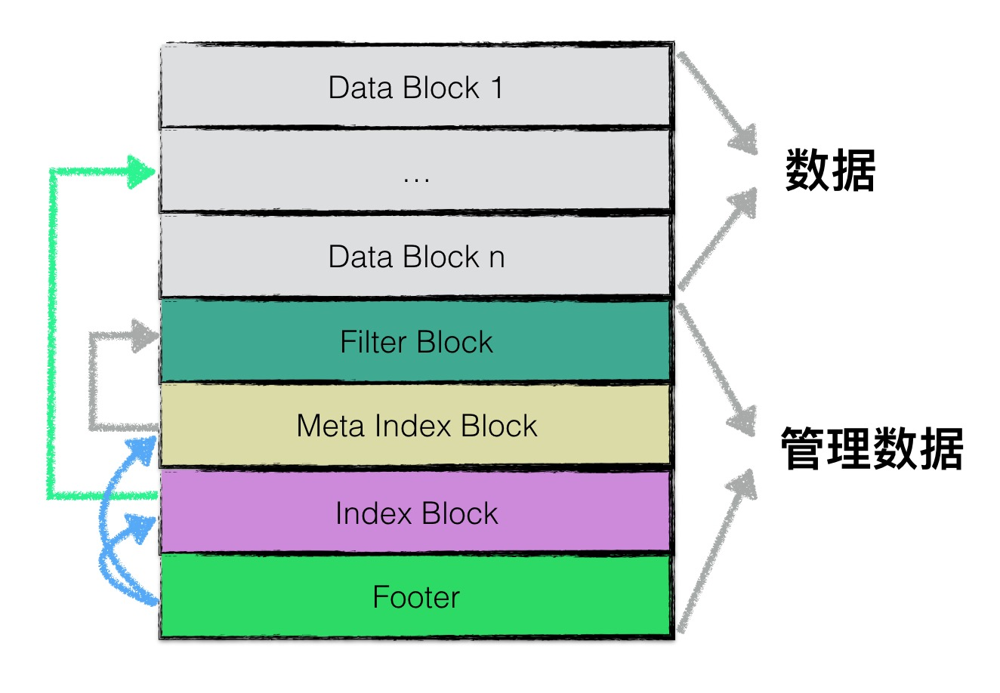

# BlockBuilder

其接收一组 key value 将其序列化到 buffer 中，buffer 中数据就是要写入文件中的数据

```cpp
//源码文件：table/block_builder.h
class BlockBuilder
{
public:
  explicit BlockBuilder(const Options *options);
  void Add(const Slice &key, const Slice &value);
  Slice Finish();
  void Reset();
  size_t CurrentSizeEstimate() const;
  bool empty() const

private:
  const Options *options_;
  std::string buffer_;
  std::vector <uint32_t> restarts_;
  int counter_;
  bool finished_;
  std::string last_key_;
};
```

- options_：LevelDB的Options。
- buffer_：序列化数据。
- restarts_：重启点位置列表。
- counter_：当前重启点关联的key数量。
- finished_：Finish()是否已经被调用过了。
- last_key_：上一次插入的key。


如果当前重启点已经关联的key数量没有超过阈值（默认阈值为16），计算当前key和重启点key的共同前缀的长度(shared)和当前key独有的后缀长度(non_shared)。如果超过阈值就停用当前重启点，并把当前key设置为新的重启点。重启点是为了让多个前缀相同的key可以复用前缀，不用把相同的前缀存储多次。重启点的间隔是固定的，默认16个key为一组，组内第一个key为重启点。因为BlockBuilder插入的key一定是有序的，所以这里共同前缀是可以节省不少空间的。

每个 block 用一个 string 存储，每 16 个一组，每组第一个保存完整的 record，其余 15 每个 record 的 key 都和前一个 record 的 key 进行比较后冗余压缩。整个 block 的最后用一个 vector 存储每 16 组的第一个 record 在 string 中的下标。（先存储 vector 元素，再存储 vector.size()），在上层还会添加两个字段，第一个是`compress type`压缩类型，如果允许压缩则会对前面整个 block 对数据使用 snappy 压缩，如果压缩后数据有减小，则开启，否则不压缩，它占一个字节，之后再在后面添加 4 个字节的 crc。


```cpp
//源码文件：table/block_builder.h
Slice BlockBuilder::Finish() {
  // Append restart array
  for (size_t i = 0; i < restarts_.size(); i++) {
    PutFixed32(&buffer_, restarts_[i]);
  }
  PutFixed32(&buffer_, restarts_.size());
  finished_ = true;
  return Slice(buffer_);
}
```


# FilterBlockBuilder

FilterBlock 的任务就是创建 filter，它和 datablock 的数量无关，datablock 就是上面 blockbuilder 中的 block


# TableBuilder

TableBuilder 用于将 Memtable 转换为 Sorted String Table。将 MemTable 转换成 SST 主要看 TableBuilder 类和 BuildTable 函数做了什么

BuildTable 内创建 TableBuilder，`builder->Finish();` 具体写一些 filter index meta 什么的。

```cpp
// table_cache: 存储文件句柄 cache
// iter: memtable 的迭代器
// meta: sst 关联的文件 metadata
Status BuildTable(const std::string& dbname, Env* env, const Options& options,
                  TableCache* table_cache, Iterator* iter, FileMetaData* meta) {
  Status s;
  meta->file_size = 0;
  iter->SeekToFirst();

  std::string fname = TableFileName(dbname, meta->number);
  if (iter->Valid()) {
    WritableFile* file;
    s = env->NewWritableFile(fname, &file);
    if (!s.ok()) {
      return s;
    }

    TableBuilder* builder = new TableBuilder(options, file);
    // 存储 minimum key
    meta->smallest.DecodeFrom(iter->key());
    Slice key;
    // 迭代 memtable 的每条 record 写 sst
    for (; iter->Valid(); iter->Next()) {
      key = iter->key();
      builder->Add(key, iter->value());
    }
    if (!key.empty()) {
      // 存储 maximum key
      meta->largest.DecodeFrom(key);
    }

    // Finish and check for builder errors
    // 写 filterblock，indexblock，footer 等
    s = builder->Finish();
    if (s.ok()) {
      meta->file_size = builder->FileSize();
      assert(meta->file_size > 0);
    }
    delete builder;

    // Finish and check for file errors
    if (s.ok()) {
      s = file->Sync();
    }
    if (s.ok()) {
      s = file->Close();
    }
    delete file;
    file = nullptr;

    if (s.ok()) {
      // Verify that the table is usable
      // 1. 检查写入是否 ok
      // 2. 将 sst 加入 tablecache
      Iterator* it = table_cache->NewIterator(ReadOptions(), meta->number,
                                              meta->file_size);
      s = it->status();
      delete it;
    }
  }

  // Check for input iterator errors
  if (!iter->status().ok()) {
    s = iter->status();
  }

  if (s.ok() && meta->file_size > 0) {
    // Keep it
  } else {
    env->RemoveFile(fname);
  }
  return s;
}
```




下面的代码是将一个 MemTable 中的数据写入 SST


```cpp
void TableBuilder::Add(const Slice& key, const Slice& value) {
  Rep* r = rep_;
  assert(!r->closed);
  if (!ok()) return;
  if (r->num_entries > 0) {
    // 当前 key 一定大于上一次插入的 key，这是由 memtable 保证的
    assert(r->options.comparator->Compare(key, Slice(r->last_key)) > 0);
  }

  // 每写完一个 datablock，在 Flush() 中标记 pending_index_entry 为 true
  if (r->pending_index_entry) {
    assert(r->data_block.empty());
    r->options.comparator->FindShortestSeparator(&r->last_key, key);
    std::string handle_encoding;
    // 将 datablock 的 offset 和 size 写入 handle_encoding
    r->pending_handle.EncodeTo(&handle_encoding);
    // last_key 是 block 中最大的 key，所以没写完一个 datablock 向 indexblock 写入
    // max_datablock_key, offset, size 这样一条记录
    r->index_block.Add(r->last_key, Slice(handle_encoding));
    r->pending_index_entry = false;
  }

  if (r->filter_block != nullptr) {
    // 更新 filter
    r->filter_block->AddKey(key);
  }

  r->last_key.assign(key.data(), key.size());
  r->num_entries++;
  // 写 datablock
  r->data_block.Add(key, value);

  const size_t estimated_block_size = r->data_block.CurrentSizeEstimate();
  // datablock 写满，开始写 WritableFile 的 buffer
  if (estimated_block_size >= r->options.block_size) {
    Flush();
  }
}
```

# WritableFile

文件句柄，Cache 里保存的就是这个东西

# ref

1. [LevelDB源码解析(8) BlockBuilder](https://www.huliujia.com/blog/6a7ee0401f/)
2. [LevelDB源码解析(10) TableBuilder（Memtable序列化）](https://www.huliujia.com/blog/02ad8ac30a/)
3. [leveldb-handbook.sstable](https://leveldb-handbook.readthedocs.io/zh/latest/sstable.html)