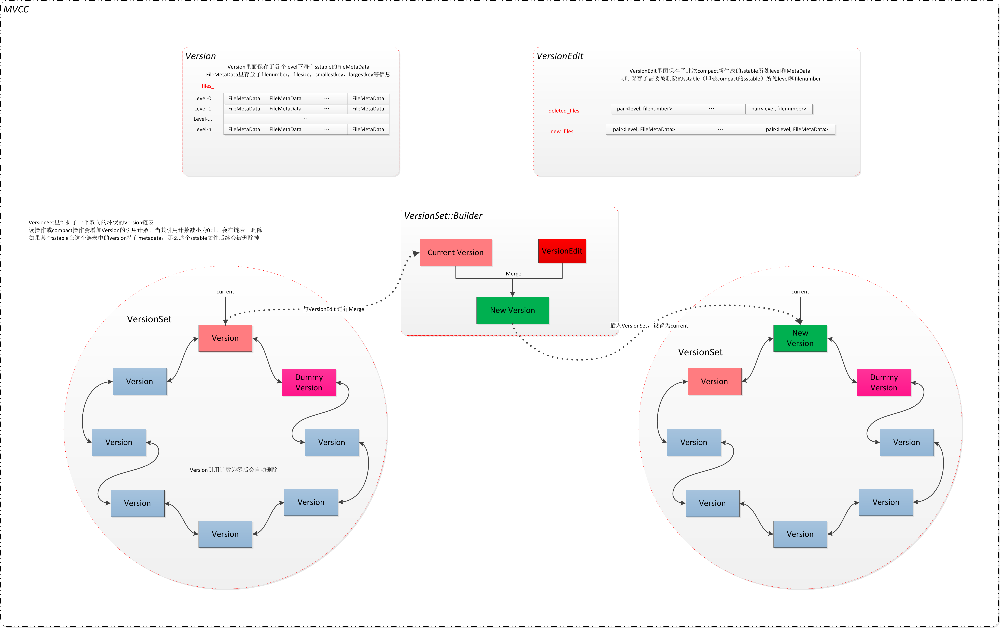

# 相关类型和文件

LevelDB 中与 Version 相关的类有三个，VersionEdit、Version、VersionSet，相关文件有 Manifest 和 Current

## Current 文件

保存当前 Manifest 文件名

## Manifest 

保存序列化后的 VersionEdit 数据

每次 LevelDB 启动时且只有启动时，会创建一个新的 Manifest 文件，并创建一个当前状态的全量快照，同时修改 Current 文件


## Version

内存中每个版本的文件信息封装为 Version 保存

```cpp
class Version {
private:
  VersionSet* vset_;  // VersionSet to which this Version belongs
  Version* next_;     // Next version in linked list
  Version* prev_;     // Previous version in linked list
  int refs_;          // Number of live refs to this version

  // List of files per level
  std::vector<FileMetaData*> files_[config::kNumLevels];

  // Next file to compact based on seek stats.
  // seek 次数超过阈值需要压缩的文件
  FileMetaData* file_to_compact_;
  // 对应的 level
  int file_to_compact_level_;

  // Level that should be compacted next and its compaction score.
  // Score < 1 means compaction is not strictly needed.  These fields
  // are initialized by Finalize().
  double compaction_score_;
  int compaction_level_;
};
```
Version 形成若干个双向链表，其中 VersionSet.ummy_versions_.Version 为 链表的头节点，Version.vset_.VersionSet* 也保存了当前 Version 属于哪个 VersionSet

Version 实际上是某个时刻描述磁盘上 SST 的状态，什么时候会产生新状态

1. imm 转换成 sst
2. 进行 compact

###  Version::AddIterators(const ReadOptions& options, std::vector<Iterator*>* iters)

version 记录了当前所有的 sst 文件，有些时候需要进行遍历，这个方法就是对当前所有 sst 文件简历 iterator

1. 对于 level 0，使用 TableCache::NewIterator() 创建，这会载入 sst 所有元数据到内存中
2. 对于 level > 0，通过 Version::NewConcatenatingIterator，其又调用了 NewTwoLevelIterator 创建 TwoLevelIterator，这会使用懒加载

## VersionSet

```cpp
Class VersionSet{
private:
  // posix 下或者 windows 下与文件系统交互的接口
  Env* const env_;
  // 数据库名称
  const std::string dbname_;
  const Options* const options_;
  // sst cache
  TableCache* const table_cache_;
  const InternalKeyComparator icmp_;
  // 下一个 sst 文件 file_number
  uint64_t next_file_number_;
  // manifest 文件 file_number
  uint64_t manifest_file_number_;
  // 最后一次操作的 seqNum
  uint64_t last_sequence_;
  // wal 文件 number
  uint64_t log_number_;
  // 如果有旧的 wal 就是旧的 wal file number, 否则是 0
  uint64_t prev_log_number_;  // 0 or backing store for memtable being compacted

  // Opened lazily
  WritableFile* descriptor_file_;
  log::Writer* descriptor_log_;
  Version dummy_versions_;  // Head of circular doubly-linked list of versions.
  Version* current_;        // == dummy_versions_.prev_

  // Per-level key at which the next compaction at that level should start.
  // Either an empty string, or a valid InternalKey.
  std::string compact_pointer_[config::kNumLevels];
};
```

VersionSet 描述了一系列的 Version 状态，以及一些系统信息或配置，最后一次操作的 seqNum，wal 的文件 number，下一个 sst 的文件 number，manifest file number

## VersionEdit

```cpp
Class VersionEdit{
  typedef std::set<std::pair<int, uint64_t>> DeletedFileSet;

  std::string comparator_;
  uint64_t log_number_;
  uint64_t prev_log_number_;
  uint64_t next_file_number_;
  SequenceNumber last_sequence_;
  bool has_comparator_;
  bool has_log_number_;
  bool has_prev_log_number_;
  bool has_next_file_number_;
  bool has_last_sequence_;

  // 产生了 compaction，对进行 compaction 的那些层的 compact_pointers_ 产生了更新
  std::vector<std::pair<int, InternalKey>> compact_pointers_;
  // 可以被删除的文件，当确定 Compaction 成功完成才可以全部删除
  DeletedFileSet deleted_files_;
  // 新的合并出的文件
  std::vector<std::pair<int, FileMetaData>> new_files_;
};
```



VersionEdit 保存着这次 Compaction 或者 imm 写 SST 产生的新的变化，所以当前最新 Version 和 VersionEdit 合并会得到一个更新的 Version。

VersionSet.LogAndApply 接受一个 VersionEdit，会向 VersionSet 里插入一个新的 Version，这个方法会调用 VersionSet.Finalize，它会根据前面得到的新的 Version 计算当前合并后，下一次最适合 Compaction 的层（每层计算 score），然后选取出 score ratio 最大的那个层

# LevelDB 的恢复

# ref

- [深入浅出LevelDB —— 06 Version](https://blog.mrcroxx.com/posts/code-reading/leveldb-made-simple/6-version/)