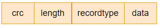

# wal

电脑断电，宕机，服务挂掉

文件格式为 `000012.log`，6 位数字加 log 后缀

LevelDB 实现了一个 Writer 类来执行预写日志，这个 Writer 可以理解为一个日志文件对象

wal 日志按 block 存储，一个 block 32 KB（32 KB 是一个合适的大小，如果 record 很小，减少多次访问磁盘的 IO 开销）

block 存储 record，每个 record 有一个 type 取值 kFullType、kFirstType、kLastType、kMiddleType，将 record 存储到 block 中，如果 record 很大，会进行分片，这个标识就来表示分片的相对位置

RecordType|含义
-|-
kFullType|第一个也是最后一个，即只有这一个 fragment
kFirstType|第一个 fragment
kLastType|最后一个 fragment
kMiddleType|不是最后一个也不是第一个 fragment 即中间的 fragment

fragment 格式

`Status Writer::AddRecord(const Slice &slice)` 就是对 slice 数据进行分片然后调用 `EmitPhysicalRecord`，后者就是写缓冲区，当缓冲区满进行 Flush

需要注意 levelDB 每写完一个 key-value 就会 sync 一下到磁盘